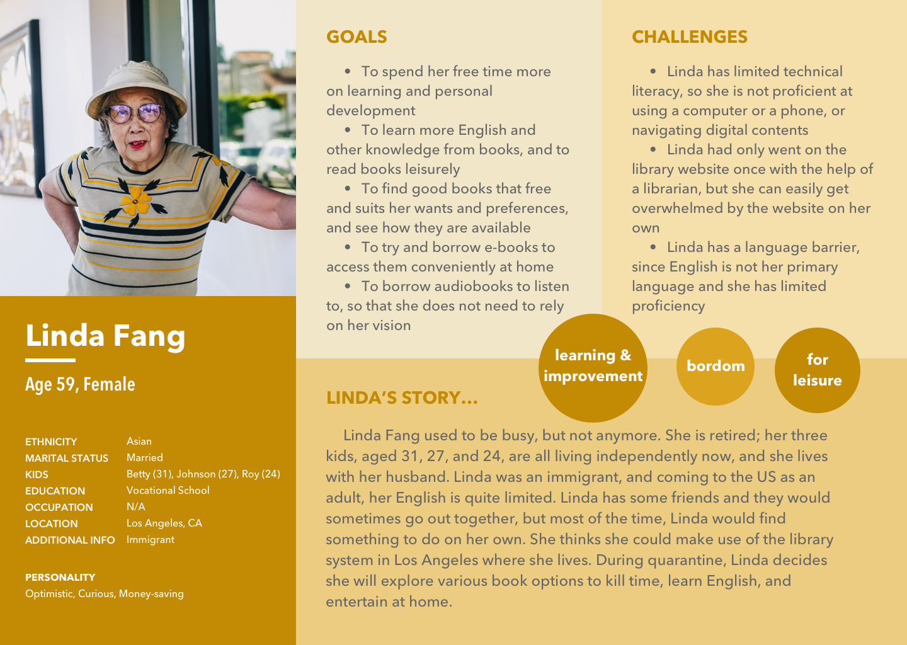

# UX Storytelling — Persona and Scenario
## Digital Humanities 150 Assignment 5 — Jane Huang

UX storytelling allows us to dive deep into the user's stories and scenarios, and see what the roles of the product is. This ensures that our design is user-centered and human-centered. I will use 2 personas with empathy maps and their scenarios and journey maps to look at how the LAPL application can fit into the picture.

Features that the design will focus on are:
* **Search page**: clear and concise search page with search filters for users to narrow their searches
* **Results recommendation**: results page after user's search includes a recommendation section to assist users in making their decision
* **Help and documentation**: help button and documentation provides guidance and specifies steps for users to perform

### Persona and Empathy Maps

#### Marian Lewis' Persona

 

#### Marian Lewis' Empathy Map

 

#### Linda Fang's Persona

 

#### Linda Fang's Empathy Map

 

### Scenarios and Journey Maps

#### Marian Lewis' Scenario

Marian Lewis is having a headache while her daughter Lila calls for her help on her new homework. As Lila gets older, Marian finds it harder and harder to assist her daughter’s schoolwork without putting in sufficient amount of effort. Meanwhile, she has a big project that is about to launch in the company she works for, in which she is the marketing manager. She is also constantly worried about her son Marcus’ college application. Marian has always been driven and responsible, but she thinks she does not have time for this many things; plus, it’s time to let Lila figure out the schoolwork herself. She went to the LAPL application so that she can find books that can help Lila with doing her homework.

On her phone, Marian goes to ‘Catalog’ and enter in the search bar ‘Great Expectations.’ A list of results is shown. Marian can see on the page which ones are available to borrow. Also, she only looks for the copies with the ‘e-book’ tab. Soon, she is able to find the copy she wants and she clicked on ‘Borrow.’ A window pops up to let her confirm, so she clicked on ‘Borrow’ again (she can otherwise click on ‘Cancel’) and she leave the default ‘borrow for’ days on, which is 21 days. Marian wants to find another book so that Lila can have more references. She is unsure what specific book to search for now, so she types in the search bar ‘Charles Dickens’ style,’ and she filters her search to only e-books. A long list of results shows up; fortunately, there is a ‘Recommended’ section shown at the top. Marian browse through the ‘Most Popular’ list, which only has 5 books. She picks and clicks on the book Authors of the 19th Century, which is available, and she borrows it. Marian is satisfied with the books she has borrowed online, and she lets Lila access the e-books on their family iPad.

#### Marian Lewis' Journey Map

 

#### Linda Fang's Scenario

Linda Fang feels extra bored and sluggish staying at home all day during quarantine. She can’t really go outside except when it’s out of necessity, and doing tedious chores only make her become lower in spirits. Her children would visit her but not frequently at all. She decides to try and do something fun and fulfilling to spend her spare time — reading books. Since English is not her native language, Linda thinks she can improve her English, and it would be fun to read interesting stories. She has only been to the LA public library branch near her house twice, and she remembers having good experience borrowing books and sitting there. She has also been introduced to the LAPL application and its basic searching function. Now that the libraries are closed, Linda thinks she can borrow e-books and audiobooks from the library and access them at home by using the LAPL application.

Linda remembers that clicking on the ‘Catalog’ icon gets her to the page that she can search for books. She saw a search bar on the page, so she clicks on it and enters ‘learning English.’ A long list of result shows up. Scrolling through the list, Linda cannot find e-books since all the books she is satisfied with are physical copies shelved in the library. She sees a ‘Help’ icon with a ‘question mark,’ and she clicks on it. She is brought to a page that shows a menu. Clicking on ‘Finding an e-book,’ Linda is brought to instructions with detailed steps on how to filter results to show e-book options. She goes back to the search page, and adjust her search filters as instructed in the help documentation. Linda is now able to see many e-book options. She selected one, and follow the steps to click on ‘Borrow.’ Since Linda also wants to try out an audiobook, she looks at the help page again and follow the instructions for searching for audiobooks. She finds out that it is similar to finding e-books, except she needs to change her search filter. She successfully does that and borrow an audiobook. She is proud of herself for not having to call her kids and ask them how to do so.

#### Linda Fang's Journey Map

 

